# Random Noise
## Introduction 
  A little demo of generating Random Noise.
  Include Perlin & SimpleX & Value noise.
  Can generate Tileable Noise.
  
## Directions 
  Use a config file to set parameters, which include [i,j,k,l].
  * [i,j]:Image size.
  * k: Pattern ID(0,1,2)
  * l: Boundary optimization(0,1,2)
      * 0:No optimization.
      * 1:Single direction optimization.
      * 2:Double direction optimization.

##  Demo 
### Value noise (Wood texture)
* Original noise  
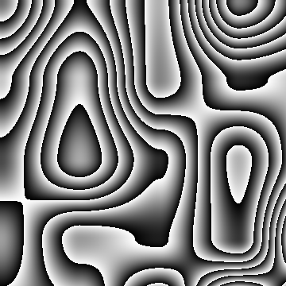
* Single Tileable noise  
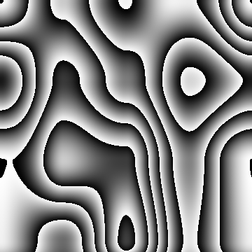
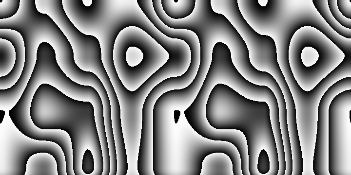
* Double Tileable noise  
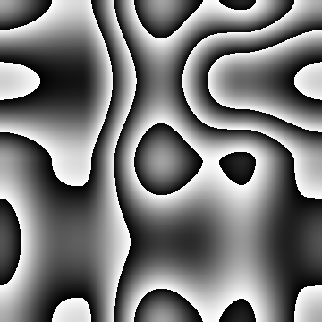
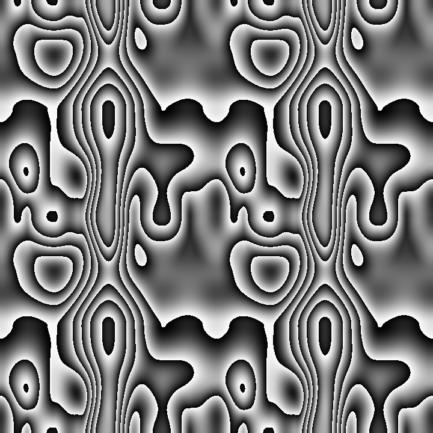

### Perlin noise (Cloud texture)
* Original noise  

* Single Tileable noise  
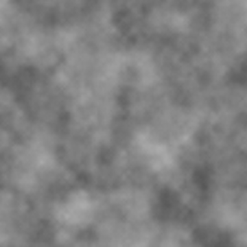
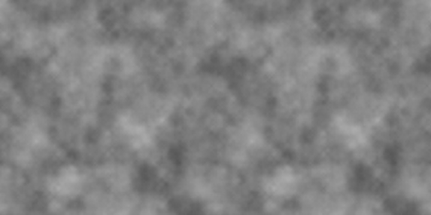
* Double Tileable noise  
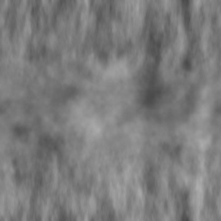
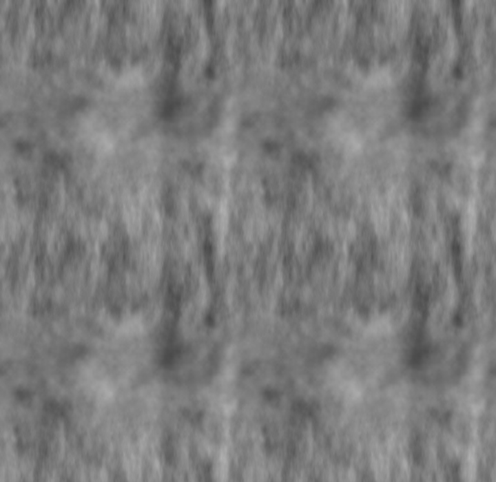

### SimpleX noise
* Original noise  
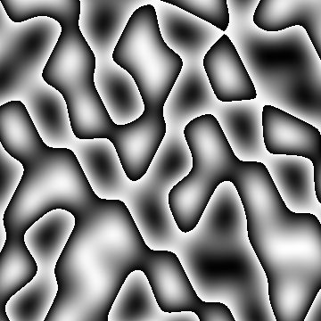
* Single Tileable noise  

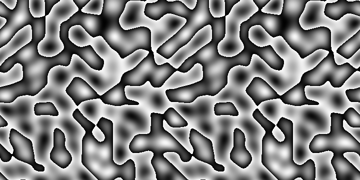
* Double Tileable noise  
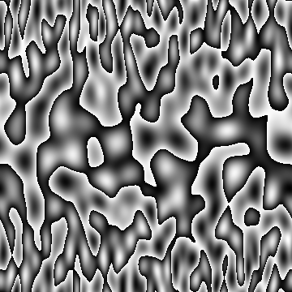
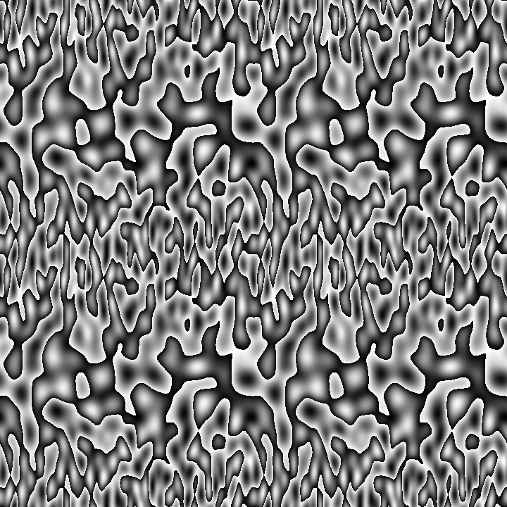

## Reference
#### Value Noise:
* https://blog.csdn.net/yolon3000/article/details/78473705
* https://blog.csdn.net/yolon3000/article/details/78483618

#### Perlin Noise:
* https://blog.csdn.net/qq_34302921/article/details/80849139
* https://cloud.tencent.com/developer/article/1005578
* https://zhuanlan.zhihu.com/p/206271895
* https://www.cnblogs.com/Memo/archive/2008/09/08/1286963.html

#### Tileable noise:
* https://weber.itn.liu.se/~stegu/TNM022-2005/perlinnoiselinks/
* https://mzucker.github.io/html/perlin-noise-math-faq.html
* https://gamedev.stackexchange.com/questions/23625/how-do-you-generate-tileable-perlin-noise
* https://blog.csdn.net/qq_14914623/article/details/90345392